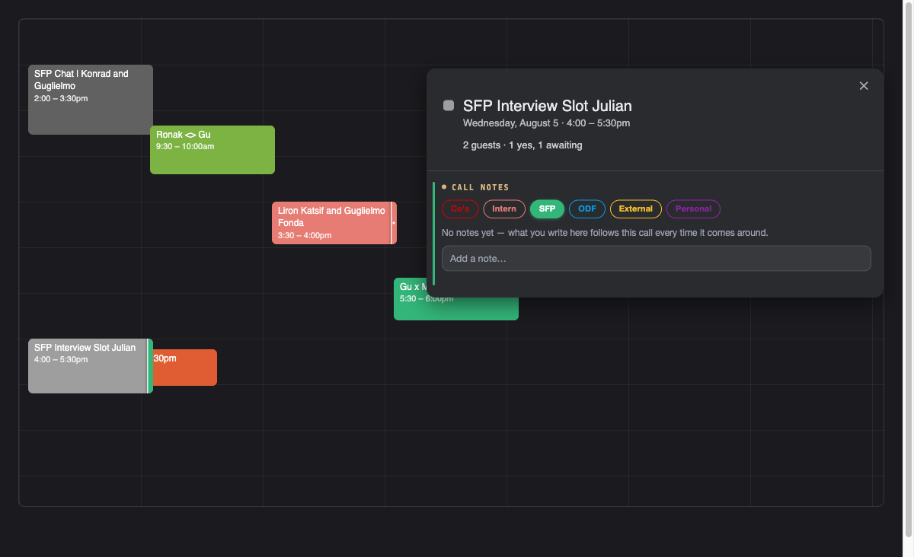
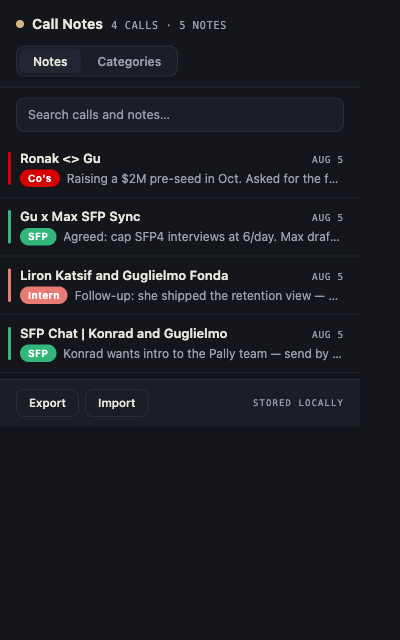
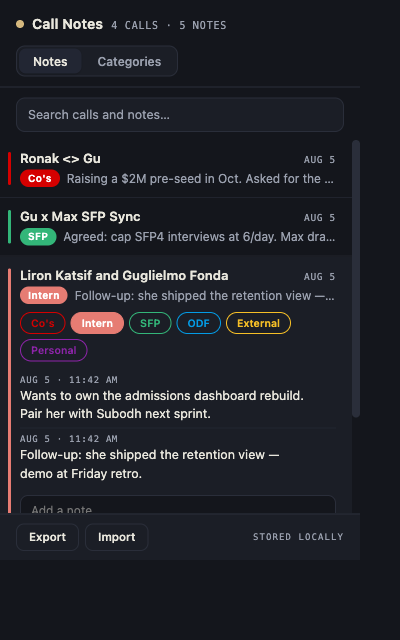
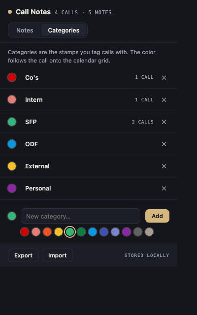

# Call Notes for Google Calendar

A Chrome extension that replaces the "side event" hack: instead of creating tiny
parallel events to remember that a call is a Co's interview or an intern chat,
click the event and stamp it — then keep a running notes log that follows the
call around.



## What it does

- **Tag any event in one click.** Open an event's bubble in Google Calendar and
  a *Call Notes* panel appears with your category stamps (seeded with Co's,
  Intern, SFP, ODF, External, Personal — all editable).
- **A running log per call.** Type a note, hit Enter. Notes are keyed to the
  event *series*, so a recurring call shows its whole history every time it
  comes around — that's the memory.
- **Stripes on the grid.** Tagged calls get a category-colored stripe down the
  chip's right edge (with a white pinhole once notes exist). The stripe renders
  above neighboring chips, so overlapping events can't bury it. If another
  event covers that edge, the marker moves to the tagged call's last visible
  pixels. A fully hidden call gets a narrow hatched rail at its own footprint.
  Markers never recolor a neighboring meeting. No more side events.
- **A ledger in the toolbar.** The extension popup lists every tagged call:
  search across titles and notes, expand a call to read or add to its log,
  jump back to the event in Calendar, and manage categories.
- **Local and portable.** Everything lives in `chrome.storage.local` on your
  machine. Export/import as JSON from the popup footer.

| Popup | Expanded call | Categories |
| --- | --- | --- |
|  |  |  |

## Install (unpacked)

1. Open `chrome://extensions` in Chrome.
2. Toggle **Developer mode** (top right).
3. Click **Load unpacked** and select this folder (the one with `manifest.json`).
4. Open [calendar.google.com](https://calendar.google.com) and click any event.

Light and dark Calendar themes are both supported — the panel picks up the
bubble's theme automatically.

## Using it

- **Tag**: click a stamp in the event bubble; click again to untag.
- **Note**: type in "Add a note…", Enter saves, Shift+Enter adds a line.
  Clicking away also saves, so half-typed thoughts aren't lost.
- **Edit/delete a note**: hover an entry — ✎ edits inline, ✕ (click twice)
  deletes.
- **Recurring calls**: all instances of a series share one log. The timestamps
  tell you which week each note came from.
- **Forget a call**: expand it in the popup → *Forget this call*.

## How it hooks into Google Calendar

Google Calendar's DOM is obfuscated, but a few hooks have been stable for
years and everything is written against those, with fallbacks:

- Event chips carry `data-eventid` (base64url of `"<eventId> <calendarId>"`).
- The event bubble is `#xDetDlg` (falls back to any `[role="dialog"]` carrying
  a `data-eventid`), with the title at `#rAECCd` (falls back to
  `[role="heading"]`, then first text line). Calendar nests the bubble inside
  outer `role="dialog"` wrappers, so only the innermost carrier gets the panel.
- Grid stripes are siblings of the chips (in the chip's positioned container)
  at `z-index: 60` — above resting chips, below hover cards and popovers.
- Recurring instances have an `_YYYYMMDD[THHMMSSZ]` suffix on the eventId; we
  strip it so notes attach to the series.

If Google ships a redesign and the panel stops appearing, those selectors in
`content/content.js` (`findDialogs`, `getTitle`) are the place to look. Your
data is untouched by DOM changes — it's keyed by event id, not by DOM.

## Troubleshooting

- **Updates self-heal.** When the extension is reloaded or updated, a
  background worker re-injects the fresh script into Calendar tabs that are
  already open; the new script sweeps out the old UI and takes over
  (`background.js` + the generation stamp on `<html>`). No tab refresh
  needed — the panel's tiny version tag (top right of "Call Notes") shows
  which build a tab is running.
- **A red banner saying "refresh this tab"** means saving genuinely failed
  (e.g. the self-heal couldn't reach this tab). ⌘R the tab and everything
  saves again. Nothing you typed is lost; it's restored into the composer.
- **Grabbing errors for a bug report**: click the small version number in
  the panel header (top right of "Call Notes") → **Copy report**. That
  copies a health snapshot plus the last errors the extension recorded — no
  DevTools needed. (For the curious: the console also gets
  `[CallNotes] v<version> active` on boot, and `__cnInfo()` works with the
  console context switched to the Call Notes extension.)

## Development

```bash
# Serve the repo and open the mock calendar (no Google login needed)
python3 -m http.server 8734
open http://127.0.0.1:8734/dev/mock.html        # dark; add ?light for light mode

# Regenerate toolbar icons (pure stdlib)
python3 dev/gen_icons.py
```

`dev/mock.html` reproduces the exact DOM hooks the content script relies on
(chips + `#xDetDlg`), and `common/store.js` transparently falls back to
`localStorage` outside the extension, so the whole flow is testable in any
browser. `popup/popup.html` can be opened from the same server.

## Layout

```
manifest.json        MV3 manifest (storage permission only)
common/store.js      CNStore — storage, series-key decoding, import/export
content/content.js   Bubble panel + grid dots (MutationObserver driven)
content/content.css  Panel + dot styles, light/dark aware
popup/               Toolbar ledger: search, log, categories, export/import
dev/                 Mock calendar, icon generator, screenshots
```

## Privacy

No servers, no analytics, no host permissions beyond `calendar.google.com`.
Notes never leave the machine unless you export them.
